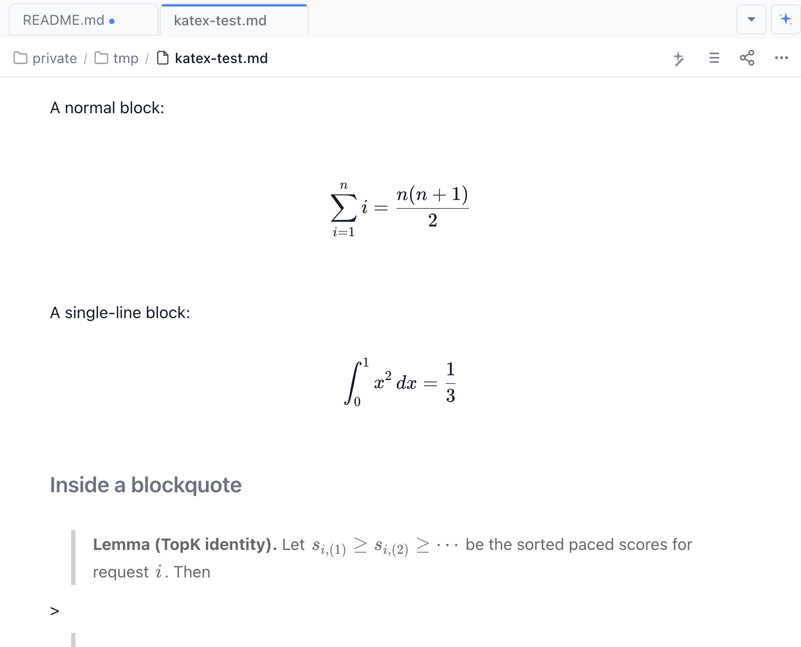

# KaTeX Math for Nimbalyst

Live LaTeX math rendering inside Nimbalyst's WYSIWYG Markdown editor.

Inline math and block-display math become first-class Lexical nodes with click-to-edit, KaTeX rendering, and clean round-tripping back to plain Markdown.



## Features

- **Inline math** (one dollar pair) — renders inline with the surrounding text
- **Block math** (two dollar pairs) — both same-line and multi-line forms
- **Click to edit** — click any rendered equation to reveal the raw TeX in an inline editor; live KaTeX preview while you type
- **Round-trip safe** — saved files contain normal Markdown math syntax. Open the file in any other editor (VS Code, Obsidian, GitHub) and the math is identical.
- **Works in blockquotes, lists, and tables** — anywhere Markdown text appears
- **Slash commands** — `/Inline Math` and `/Block Math` from the command picker
- **AI tool** — Claude can call `katex.insert_equation` to author equations directly into your document

## Supported syntax

The extension recognises the same math delimiters as GitHub-flavoured Markdown, Obsidian, and Pandoc:

```text
Use single-dollar pairs around inline math, like:

  Einstein's mass-energy equivalence is &#36;E = mc^2&#36;.

Use double-dollar pairs for block math, either on one line:

  &#36;&#36;\int_0^1 x^2\,dx = \frac{1}{3}&#36;&#36;

or across multiple lines:

  &#36;&#36;
  \sum_{i=1}^{n} i = \frac{n(n+1)}{2}
  &#36;&#36;
```

Anything KaTeX understands is supported — see the [KaTeX function reference](https://katex.org/docs/supported.html).

The extension deliberately ignores patterns that look like prices, e.g. `&#36;5 and &#36;10` (whitespace and digit boundaries are excluded so currency text never accidentally renders).

## Installation

### From Nimbalyst (recommended)

1. Open **Marketplace → Discover** in Nimbalyst.
2. Click **Install from GitHub** at the bottom of the page.
3. Paste this repo's URL.

### Manual

```sh
git clone https://github.com/yugao/nimbalyst-katex-extension
cd nimbalyst-katex-extension
npm install
npm run build
```

Then in Nimbalyst's Developer panel, run `extension_install` against this directory.

## How it works

The extension contributes two Lexical decorator nodes (`InlineMathNode`, `BlockMathNode`) and three Markdown transformers:

| Transformer | Type | Purpose |
| --- | --- | --- |
| `BLOCK_MATH_INLINE_TRANSFORMER` | text-match | Single-line `$$x$$` block math |
| `BLOCK_MATH_TRANSFORMER` | multiline-element | Multi-line `$$ … $$` block math |
| `INLINE_MATH_TRANSFORMER` | text-match | Inline `$x$` math |

The order matters: the block transformers are registered before the inline one so the host's outermost-match algorithm always prefers the wider span.

The Lexical APIs are accessed through `window.__nimbalyst_extensions.lexical`, so the extension stays compatible with Nimbalyst's bundled Lexical version without locking a copy into the extension build.

## AI tool

```ts
katex.insert_equation({
  tex: "\\sum_{i=1}^{n} i = \\frac{n(n+1)}{2}",
  displayMode: true   // false for inline
})
```

Permissions: `ai` (declared in `manifest.json`). Claude can call this tool whenever a Markdown document is the active editor.

## Development

```sh
npm run build       # one-shot build
npm run dev         # watch mode (vite build --watch)
```

Hot-reload during development:

```ts
extension_reload({
  extensionId: "com.nimbalyst.katex-math",
  path: "/absolute/path/to/this/repo"
})
```

## Limitations & roadmap

- **Macros / `\newcommand`** — KaTeX supports them per-call but we don't yet expose a workspace-scoped macro file. v0.2 candidate.
- **Equation numbering** — no auto `\tag` yet. v0.2 candidate.
- **Copy-as-PNG / copy-as-LaTeX** — currently copying a rendered equation puts the raw TeX (with delimiters) on the clipboard. v0.2 candidate.

## License

MIT — see [LICENSE](./LICENSE).

## Acknowledgements

- [KaTeX](https://katex.org) for the rendering engine
- The Nimbalyst team for the Excalidraw and DataModelLM extensions, which were the reference for the Lexical node + transformer contribution pattern
